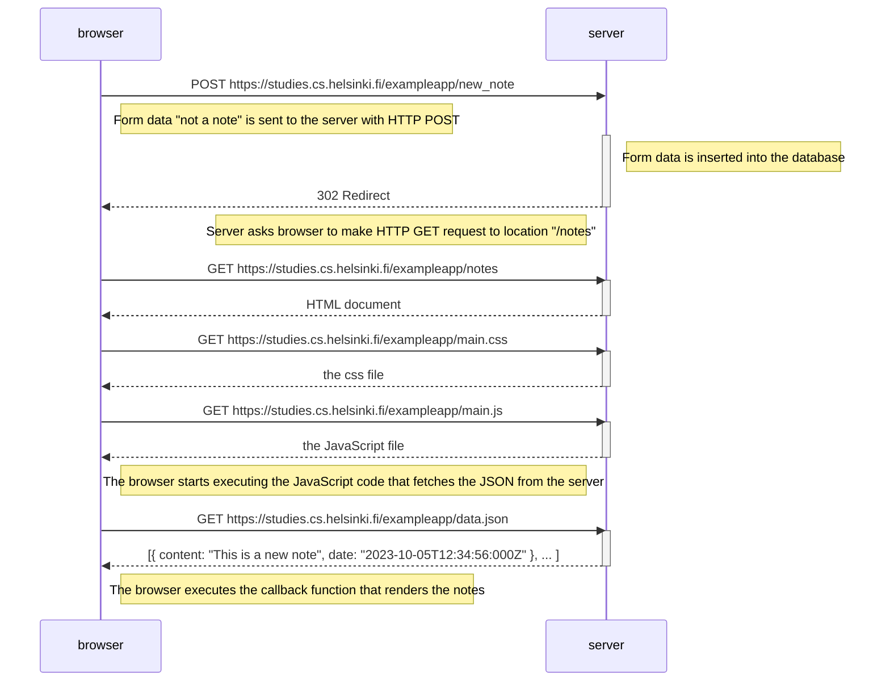
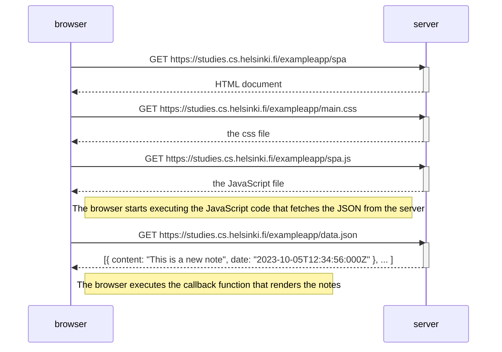
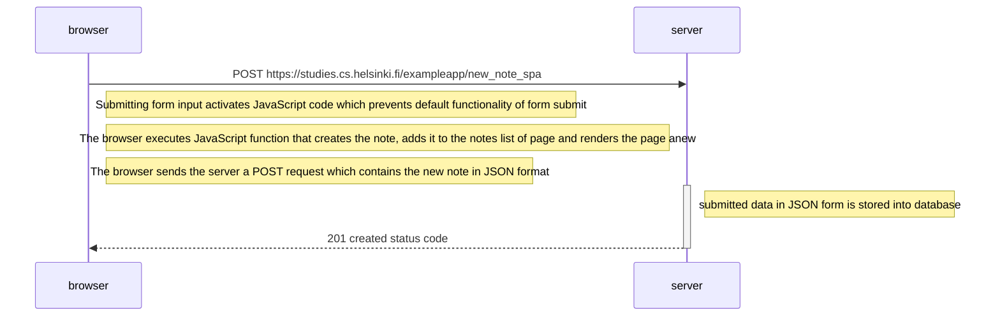

# Osa 0

Web-sovellusten toiminnan perusteet
Osan 0 tehtävien vastaukset 

## Tehtävä 0.4: Uusi muistiinpano

```mermaid
sequenceDiagram;
  participant browser;
  participant server;
    
  browser->>server: POST https://studies.cs.helsinki.fi/exampleapp/new_note;

  Note right of browser: Form data "not a note" is sent to the server with HTTP POST;
  activate server;
  Note right of server: Form data is inserted into the database;  
  server-->>browser: 302 Redirect;
  deactivate server;
  Note left of server: Server asks browser to make HTTP GET request to location "/notes";

  browser->>server: GET https://studies.cs.helsinki.fi/exampleapp/notes;
  activate server;
  server-->>browser: HTML document;
  deactivate server;

  browser->>server: GET https://studies.cs.helsinki.fi/exampleapp/main.css;
  activate server;
  server-->>browser: the css file;
  deactivate server;
    
  browser->>server: GET https://studies.cs.helsinki.fi/exampleapp/main.js;
  activate server;
  server-->>browser: the JavaScript file;
  deactivate server;
    
  Note right of browser: The browser starts executing the JavaScript code that fetches the JSON from the server;
    
  browser->>server: GET https://studies.cs.helsinki.fi/exampleapp/data.json;
  activate server;
  server-->>browser: [{ content: "This is a new note", date: "2023-10-05T12:34:56:000Z" }, ... ];
  deactivate server;

  Note right of browser: The browser executes the callback function that renders the notes;

```

## Tehtävä 0.5: Single Page App

```mermaid
sequenceDiagram;
  participant browser;
  participant server;
    
  browser->>server: GET https://studies.cs.helsinki.fi/exampleapp/spa;
  activate server;
  server-->>browser: HTML document;
  deactivate server;

  browser->>server: GET https://studies.cs.helsinki.fi/exampleapp/main.css;
  activate server;
  server-->>browser: the css file;
  deactivate server;
    
  browser->>server: GET https://studies.cs.helsinki.fi/exampleapp/spa.js;
  activate server;
  server-->>browser: the JavaScript file;
  deactivate server;
    
  Note right of browser: The browser starts executing the JavaScript code that fetches the JSON from the server;
    
  browser->>server: GET https://studies.cs.helsinki.fi/exampleapp/data.json;
  activate server;
  server-->>browser: [{ content: "This is a new note", date: "2023-10-05T12:34:56:000Z" }, ... ];
  deactivate server;

  Note right of browser: The browser executes the callback function that renders the notes;

```

## Tehtävä 0.6: Uusi muistiinpano

```mermaid
sequenceDiagram;
  participant browser;
  participant server;
    
  browser->>server: POST https://studies.cs.helsinki.fi/exampleapp/new_note_spa;
  Note right of browser: Submitting form input activates JavaScript code which prevents default functionality of form submit;
  Note right of browser: The browser executes JavaScript function that creates the note, adds it to the notes list of page and renders the page anew;
  Note right of browser: The browser sends the server a POST request which contains the new note in JSON format;
  activate server;
  Note right of server: submitted data in JSON form is stored into database;
  server-->>browser: 201 created status code ;
  deactivate server;

```
